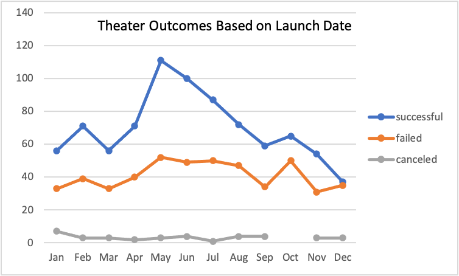
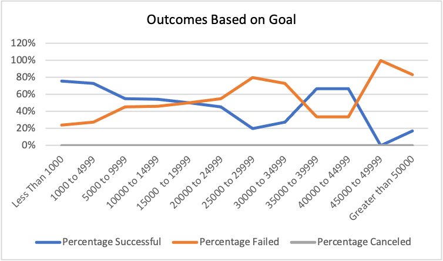
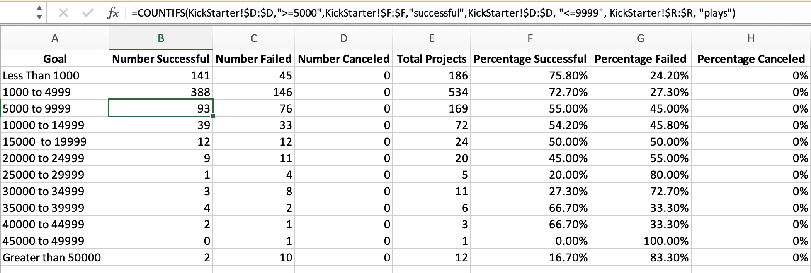

# Kickstarting with Excel

## Overview of Project

Louise, who is an up-and-coming playwright, is planning to start her crowdfunding campaign for funding her new play "Fever" with an estimated budget of over **\$10,000**. As a result, the Kickstarter data is being analyzed with the use of Microsoft Excel for uncovering trends and providing insights into how campaign outcomes are being influenced with various factors and which factors contribute to the success of those campaigns.

### Purpose

The purpose of this project is to help Louise determine which factors contribute to the success of a campaign and how previous campaigns performed with respect to their launch dates and funding goals. Hence, Microsoft Excel is used as a tool for performing two technical analyses which are as follows:

1.	Outcomes based on launch date 
2.	Outcomes based on goals

## Analysis and Challenges

This section of the report focuses on the two aforementioned technical analysis that were performed with the use of Excel advanced formulas and interactive graphs. Additionally, the challenges that were encountered and the way they were overcome are explained in this section.

### Analysis of Outcomes Based on Launch Date

This analysis was carried out with the use of pivot table and pivot chart graphing in Excel for visualizing successful, failed and cancelled campaign outcomes based on the launch date. Initially, an additional column was created in the Kickstarter worksheet with the use of **YEAR()** function for extracting the years from the "Date Created Conversion" column that was created from the data cells of the "Launched_at" column after converting the Unix timestamps to human readable dates. Then a pivot table was created in a new sheet from the Kickstarter worksheet and was filtered based on the "Parent Category" and "Years". The pivot table was then established after filling the pivot table fields as follow:

- Parent category and years into **filters** quadrant.
- Outcomes into **columns** quadrant.
- Date created conversions into **rows** quadrant.
- Count of outcomes into **values** quadrant.

The Figure shown below, demonstrates the line charts extracted from the pivot table after filtering the columns to only display the **successful**, **failed** and **canceled** outcomes and the parent category to only show the "theater" category. This line chart was created for analyzing the trends of **successful**, **failed** and **canceled** outcomes based on the campaign's launch date, thus, helping us visualize which months of the year were the most and the least successful. 

### Analysis of Outcomes Based on Goals

This analysis was performed for visualizing the percentage of **successful**, **failed**, and **canceled** 
plays based on the 12 different ranges of goal amounts that were provided. Thus, the **COUNTIF()** function was used for gathering the outcomes and goal data for the "plays" subcategory. 

Figure below depicts the graph of the outcomes based on the goal showing the relation between the goal-amount ranges and the percentage of successful, failed and canceled projects which helps Louise determine if her fund raising goal has a high chance of success or failure.

### Challenges and Difficulties Encountered

One of the challenges encountered was using the **COUNTIFS()** function for populating the number of campaign outcomes as a slight change and not including the ranges in their right location within the formula resulted in different numbers and hence different percentage outcomes. However, this challenge was then overcome by several trial and error ensuring that the goal ranges were placed before and after the required columns within the formula as shown in the Figure below. Additionally, the data was also plotted multiple times until the error within the formula was detected. 

Another challenge that could have been faced would have been with respect to the launch dates of campaigns. Since we needed the campaign years for performing the analysis based on theater outcomes by launch date, this challenge could have been encountered if the launch dates were not converted into readable date formats as they were initially in UNIX timestamps. However, this was prevented as the launch dates were already converted into readable formats using the instructions given throughout the module.

## Results

This section of the report focuses on the results achieved from the two technical analysis that were performed with some recommendations on how the dataset could have been improved and what additional charts could have been plotted for a additional analysis.

- **Conclusions for Outcomes by Launch Date:**

The conclusions that can be drawn from the outcomes based on launch date is that the launch date plays an important role on the outcomes of campaigns as in our case the month of **May** launched the most successful Kickstarter campaigns, followed by month of **June** with success rates of **111** and **100** respectively, after which it decreased rapidly in the remaining months of the year reaching to a least rate of success by the end of the year in **December**. As a result of this, it would be a good idea if Louise considers launching the theater based campaign in **May**. 

Additionally, it was concluded that the rate of canceled theater projects were very few in each month and approximately close to one another throughout the year. This helps Louise know her chances of having canceled campaign would be very low.

- **Conclusion for Outcomes Based on Goals:**

Using the data achieved from the outcomes based on goals, it can be concluded that Louise has approximately **50%** chances of having a successful play campaign with her fund raising goal of more than **\$10,000** but less than **\$25,000**. Thus, it is advisable that she reduces her funding goal to **\$5,000** or less so that she can have more than **50%** chances of having a successful campaign. It can also be noted that goal range amounts of **\$35,000** to **$44,999** had a high success rate which could be due to factors other than the goal amounts.

- **Limitations of Dataset:**

One of the limitations was that the most recent year in this dataset was 2017, hence, to provide Louise with a better analysis with her campaign goal it is advisable to add data corresponding to the most recent years to have a more up-to-date analysis. 

Additionally, the dataset was limited to few factors for determining the campaign outcome as there are various of other factors that could be have been analyzed and played a role on the outcome aside from the goal amounts and the launch dates. 

Other limitation of this dataset was that Louise provided us only with her fundraising goal, as it would have been better if she would have set a timeline for her fundraising campaign as well. 

- **Recommendations:** 

One of the possible graphs that could be created is the box plot which is also known as the box and whisker plot for comparing the distribution of campaign goals and total amounts pledged for "plays" in United States.

Additionally, the duration of the "plays" campaigns with respect to their launch and deadline date could have been plotted in a histogram chart.

